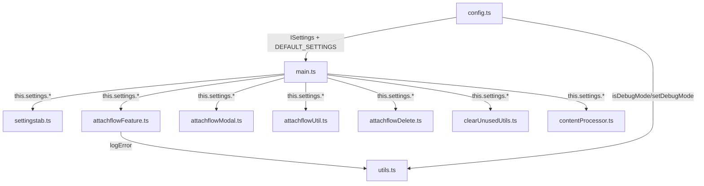

## 产品概述

对 ImgBox Pro Obsidian 插件的设置系统进行统一重构：合并重复配置字段、重命名为语义清晰的统一命名、语言切换改为跟随 Obsidian 系统语言。

## 核心功能

- **合并重复字段**：删除去向 3 合 1、压缩开关 2 合 1、日志弹窗 2 合 1、调试模式 2 合 1
- **统一字段命名**：清除 `clearUnused*`、`attachFlow*`、`realTimeUpdate` 等遗留前缀，统一为 ImgBox Pro 风格
- **语言跟随系统**：移除 `language` 设置项，设置页语言由 `document.documentElement.lang` 自动判定
- **设置迁移**：旧字段自动映射到新字段，用户升级无感知

## 技术栈

- 语言：TypeScript 4.x
- 构建：Rollup 2.x
- 运行时：Obsidian Plugin API（桌面端）
- 无新增依赖

## 实现方案

### 核心策略：字段重命名 + 合并 + 迁移

1. **ISettings 接口重构**：在 `config.ts` 中定义全新的 `ISettings` 接口，删除所有旧字段，替换为新字段
2. **VERBOSE 模块变量移除**：将 `config.ts` 中的 `let VERBOSE` / `setDebug()` 替换为 `settings.debugMode` 的直接读取
3. **设置页语言切换**：`settingstab.ts` 中将 `const lang = this.plugin.settings.language === "en" ? "en" : "zh-CN"` 改为 `const lang = document.documentElement.lang?.toLowerCase().startsWith("zh") ? "zh-CN" : "en"`
4. **设置迁移**：在 `main.ts` 的 `loadSettings()` 中添加一次性迁移函数，检测旧字段存在时映射到新字段并保存

### 字段映射表

#### 合并类（多字段 → 一字段）

| 旧字段 | 新字段 | 迁移逻辑 |
| --- | --- | --- |
| `clearUnusedDeleteOption` + `attachFlowDeleteOption` + `removeOrphansCompl` | `deleteDestination` | 优先取 `attachFlowDeleteOption`；若 `removeOrphansCompl=true` 则为 `"permanent"` |
| `PngToJpeg` + `PngToJpegLocal` | `compressImage` | 任一为 true 则 true |
| `clearUnusedLogsModal` + `attachFlowLogsModal` | `showOperationLogs` | 任一为 true 则 true |
| `VERBOSE` + `attachFlowDebug` | `debugMode` | 任一为 true 则 true |


#### 重命名类（一字段 → 一字段）

| 旧字段 | 新字段 |
| --- | --- |
| `realTimeUpdate` | `autoProcess` |
| `realTimeUpdateInterval` | `autoProcessInterval` |
| `processCreated` | `processNewMarkdown` |
| `processAll` | `processNewAttachments` |
| `disAddCom` | `hideExtraCommands` |
| `clearUnusedRibbonIcon` | `showCleanupRibbon` |
| `clearUnusedExcludeSubfolders` | `excludeSubfolders` |
| `ExcludedFoldersList` | `excludedFolders` |
| `ExcludedFoldersListRegexp` | `excludedFoldersRegexp` |
| `ImgCompressionType` | `compressionFormat` |
| `JpegQuality` | `compressionQuality` |
| `saveAttE` | `attachmentSaveLocation` |
| `ignoredExt` | `excludedExtensions` |
| `downUnknown` | `downloadUnknownTypes` |
| `useCaptions` | `preserveCaptions` |
| `addNameOfFile` | `appendOriginalName` |
| `pathInTags` | `linkPathFormat` |
| `useTimestampNameForNewAtt` | `useTimestampNaming` |
| `removeMediaFolder` | `syncMediaFolder` |
| `mediaRootDir` | `mediaFolderPath` |
| `DoNotCreateObsFolder` | `skipObsidianFolderCreation` |
| `DateFormat` | `dateFormat` |
| `filesizeLimit` | `minFileSizeKB` |
| `tryCount` | `downloadRetryCount` |
| `attachFlowDragResize` | `dragResizeEnabled` |
| `attachFlowResizeInterval` | `dragResizeStep` |
| `attachFlowClickView` | `clickPreviewEnabled` |
| `attachFlowAdaptiveRatio` | `previewAdaptiveRatio` |
| `attachFlowMoveFileMenu` | `showMoveFileMenu` |
| `includeps` | `includePattern` |
| `includepattern` | `includePatternRegex` |


#### 删除类

| 旧字段 | 原因 |
| --- | --- |
| `language` | 改用 `document.documentElement.lang` |
| `VERBOSE`（模块变量） | 合并到 `debugMode`，不再作为独立模块变量 |


### 新 ISettings 接口

```typescript
export interface ISettings {
  // ---- 通用 ----
  showNotifications: boolean;
  hideExtraCommands: boolean;
  showCleanupRibbon: boolean;
  autoProcess: boolean;
  autoProcessInterval: number;
  processNewMarkdown: boolean;
  processNewAttachments: boolean;
  useTimestampNaming: boolean;
  // 开发者选项
  includePattern: string;
  includePatternRegex: string;
  debugMode: boolean;

  // ---- 图片本地化 ----
  downloadRetryCount: number;
  downloadUnknownTypes: boolean;
  compressImage: boolean;
  compressionFormat: string;
  compressionQuality: number;
  minFileSizeKB: number;
  excludedExtensions: string;
  preserveCaptions: boolean;
  appendOriginalName: boolean;
  linkPathFormat: string;
  dateFormat: string;
  attachmentSaveLocation: string;
  syncMediaFolder: boolean;
  mediaFolderPath: string;
  skipObsidianFolderCreation: boolean;

  // ---- 图片清理 ----
  deleteDestination: string;
  showOperationLogs: boolean;
  excludeSubfolders: boolean;
  excludedFolders: string;
  excludedFoldersRegexp: string;

  // ---- 图片预览 ----
  showMoveFileMenu: boolean;
  clickPreviewEnabled: boolean;
  previewAdaptiveRatio: number;
  dragResizeEnabled: boolean;
  dragResizeStep: number;
}
```

### 迁移函数设计

在 `main.ts` 的 `loadSettings()` 中，加载 `savedSettings` 后、赋值给 `this.settings` 前，执行迁移：

```typescript
private migrateSettings(saved: Record<string, any>): Partial<ISettings> {
  const migrated: Record<string, any> = {};
  // 仅在旧字段存在时迁移（新安装用户跳过）
  if ('clearUnusedDeleteOption' in saved || 'attachFlowDeleteOption' in saved) {
    migrated.deleteDestination = saved.attachFlowDeleteOption ?? saved.clearUnusedDeleteOption ?? '.trash';
    if (saved.removeOrphansCompl === true) migrated.deleteDestination = 'permanent';
  }
  if ('PngToJpeg' in saved || 'PngToJpegLocal' in saved) {
    migrated.compressImage = !!(saved.PngToJpeg || saved.PngToJpegLocal);
  }
  if ('clearUnusedLogsModal' in saved || 'attachFlowLogsModal' in saved) {
    migrated.showOperationLogs = !!(saved.clearUnusedLogsModal && saved.attachFlowLogsModal);
  }
  if ('VERBOSE' in saved || 'attachFlowDebug' in saved) {
    migrated.debugMode = !!(saved.VERBOSE || saved.attachFlowDebug);
  }
  // 一对一重命名映射（省略，逐字段检查旧 key 存在则写入新 key）
  // ...
  return migrated as Partial<ISettings>;
}
```

### VERBOSE/setDebug 重构

当前 `config.ts` 导出模块变量 `VERBOSE` 和 `setDebug()`，被 `utils.ts` 的 `logError()` 引用。重构方案：

- 删除 `VERBOSE` 模块变量和 `setDebug()` 函数
- `logError()` 改为接受 `debugMode: boolean` 参数，由调用方传入 `this.plugin.settings.debugMode`
- 或者在 `utils.ts` 中新增 `setDebugMode()` / `isDebugMode()` 模块级读写（与现有模式兼容，改动最小）

选择后者（模块级读写），改动最小且保持 `logError()` 签名不变。

## 实现注意事项

- **向后兼容**：迁移逻辑必须在新安装用户（无旧字段）和升级用户（有旧字段）两种场景下都能正常工作
- **VERBOSE 引用链**：`utils.ts` 导入 `VERBOSE`，`settingstab.ts` 导入 `setDebug`，`attachflowFeature.ts` 调用 `setDebug()`——三者需同步修改
- **compressImage 语义变化**：原来 `PngToJpeg`（默认 false）和 `PngToJpegLocal`（默认 true）行为不同，合并后默认值取 true（因为粘贴压缩默认开启）
- **deleteDestination 合并 removeOrphansCompl**：原 `removeOrphansCompl` 仅影响 "Clear Unlinked Attachments in Current Note Folder" 命令，合并后该命令也统一读取 `deleteDestination`，若为 `"permanent"` 则彻底删除
- **attachFlowLogsModal 未被功能代码引用**：搜索发现该字段仅在 `settingstab.ts` 中读写，实际弹窗显示由 `attachflowFeature.ts` 中的 `DeleteAllLogsModal` 控制（始终弹出），合并后需确认 `showOperationLogs` 是否也需要控制 AttachFlow 弹窗

## 架构设计



## 目录结构

```
src/
├── config.ts                # [MODIFY] ISettings 接口全部重写，DEFAULT_SETTINGS 全部更新，VERBOSE/setDebug 替换为 isDebugMode/setDebugMode
├── settingstab.ts           # [MODIFY] 删除语言切换 UI，所有字段绑定改为新字段名，语言检测改用 document.documentElement.lang
├── main.ts                  # [MODIFY] 所有字段引用更新，新增 migrateSettings() 迁移函数，删除 getDefaultSettingsLanguage()，VERBOSE 引用更新
├── utils.ts                 # [MODIFY] VERBOSE 引用改为 isDebugMode()
├── attachflowFeature.ts     # [MODIFY] attachFlow* 字段引用更新，setDebug() 调用更新
├── attachflowModal.ts       # [MODIFY] attachFlowDeleteOption → deleteDestination
├── attachflowUtil.ts        # [MODIFY] attachFlowDeleteOption → deleteDestination
├── attachflowDelete.ts      # [MODIFY] attachFlowDeleteOption → deleteDestination
├── attachflowDeleteAll.ts   # [MODIFY] AttachFlowHost 类型引用（如涉及 settings 字段需更新）
├── clearUnusedUtils.ts      # [MODIFY] clearUnusedDeleteOption → deleteDestination, clearUnusedExcludeSubfolders → excludeSubfolders
├── contentProcessor.ts      # [MODIFY] PngToJpeg → compressImage, ImgCompressionType → compressionFormat, JpegQuality → compressionQuality
└── (其余 .ts 文件不变)
```

## SubAgent

- **code-explorer**: 在实施过程中用于快速定位特定字段的引用位置，确保所有旧字段引用都已更新为新字段